# Job Finder - Client

This is the frontend part of this app, backend part of this app is [here](https://github.com/ZhangYW18/sjobfinder-server).

This web app is based on React.js.

## How to run

Before running this project, run the backend part of this app first.

Then install dependencies and run this project using `npm`:

```shell
npm install
npm start
```

## Register & Login

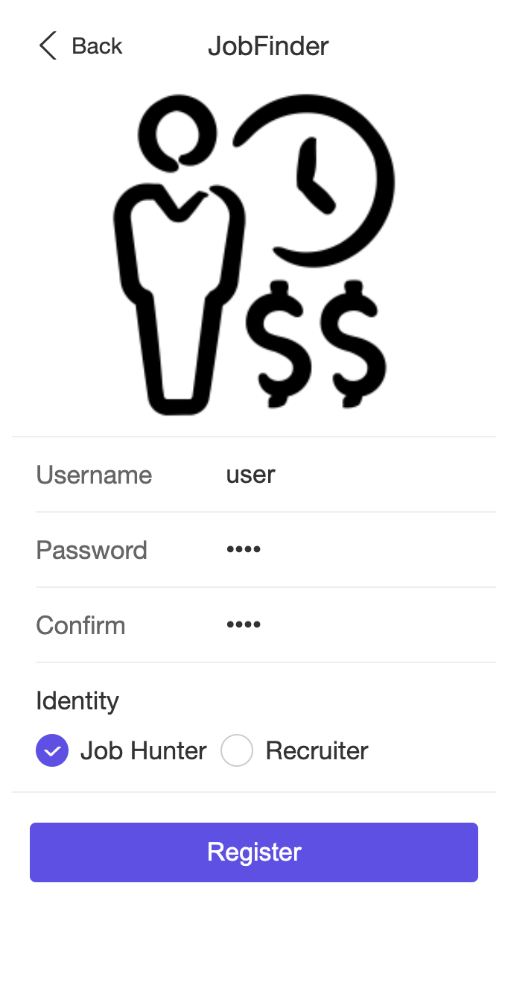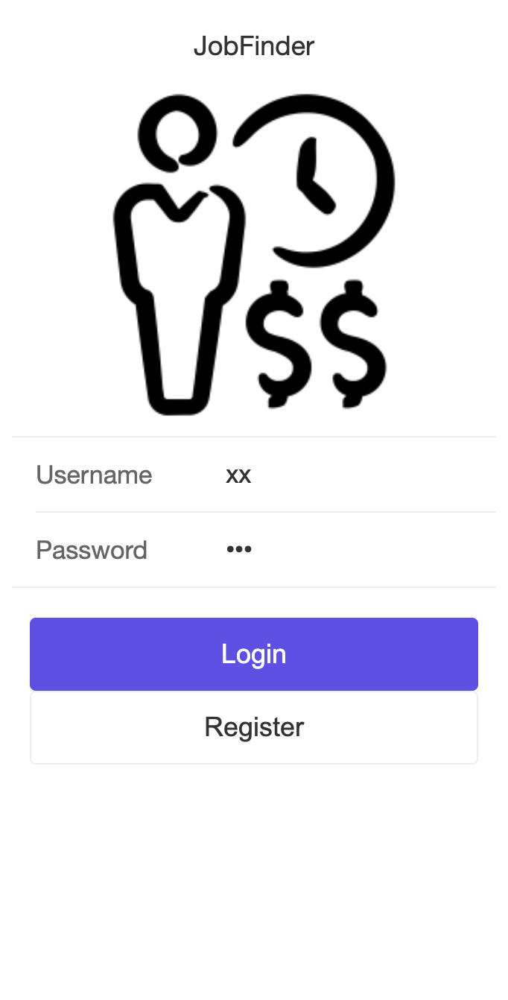

## Personal Profiles

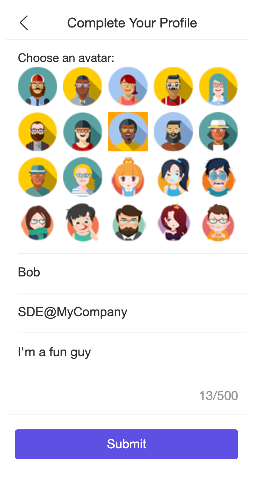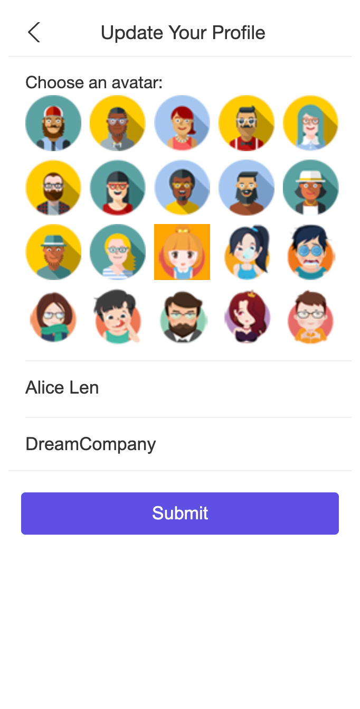


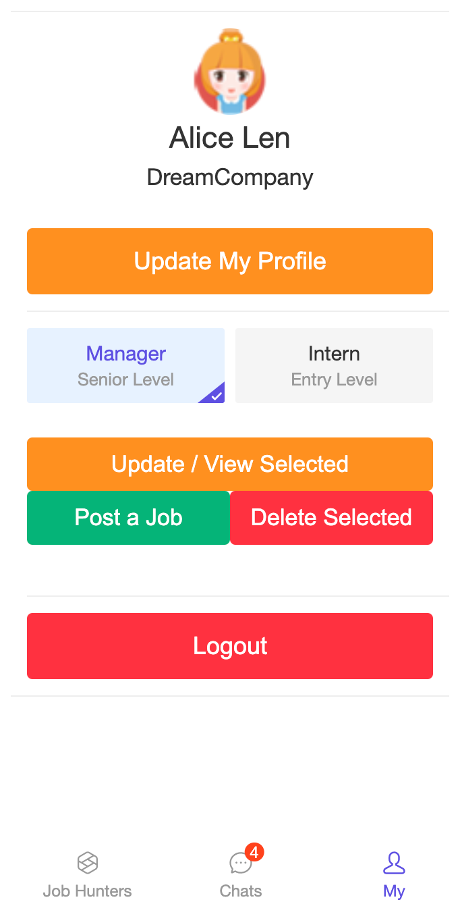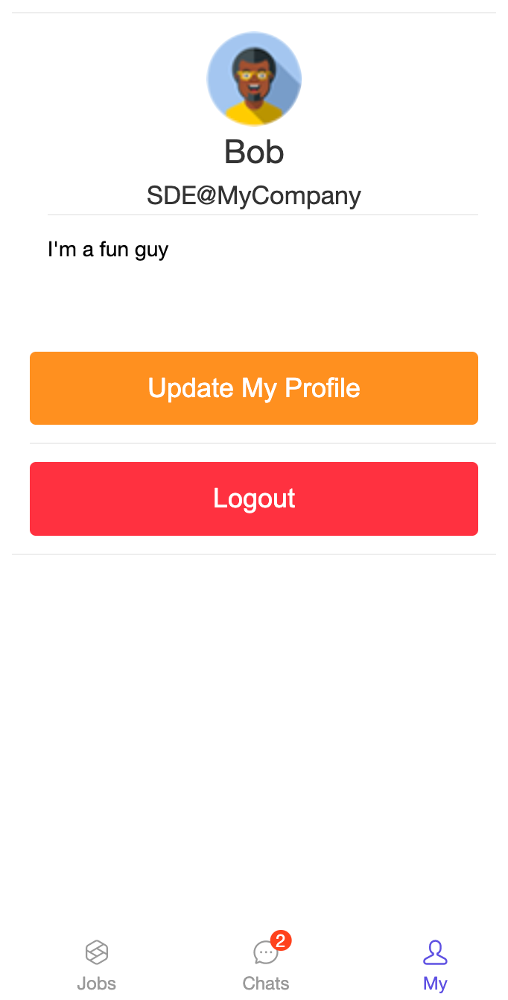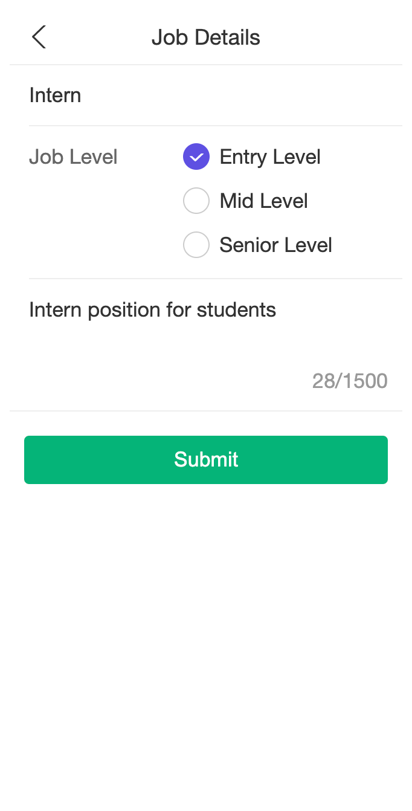


## Available Jobs / Job Hunters

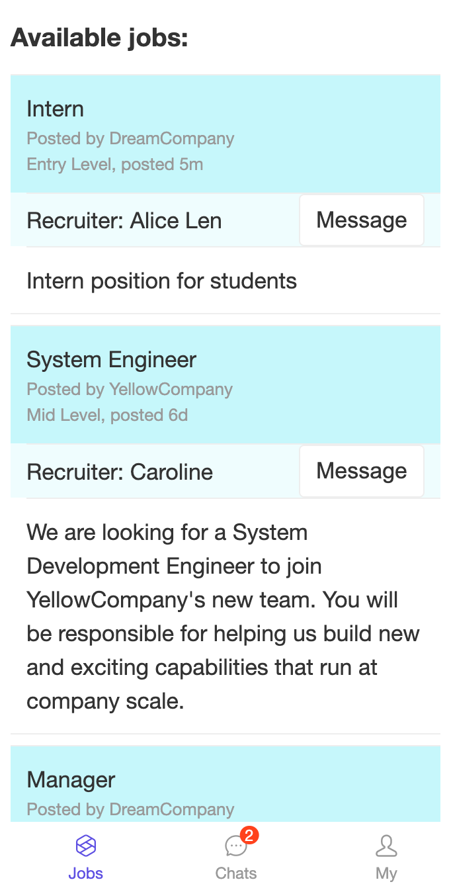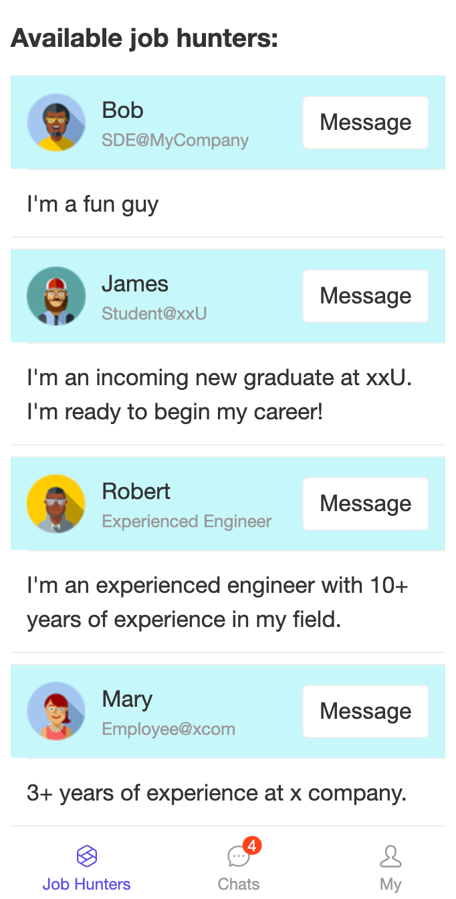


## Online Chat

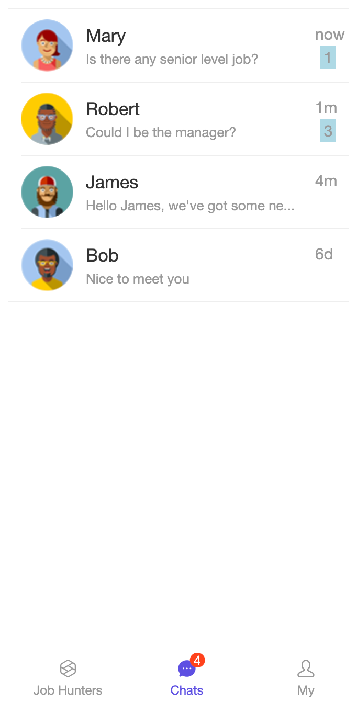 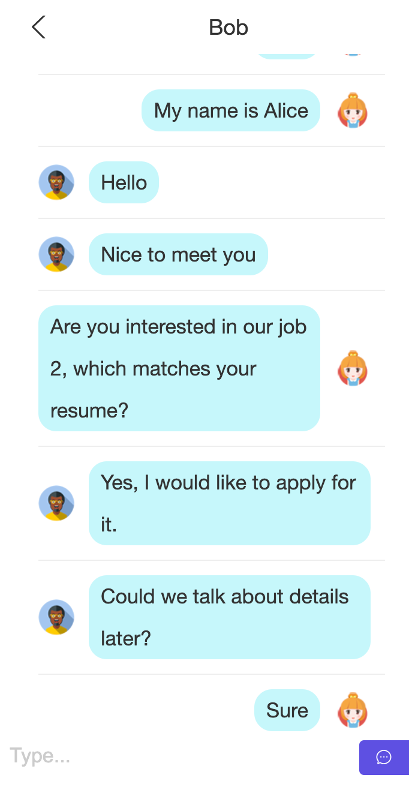

